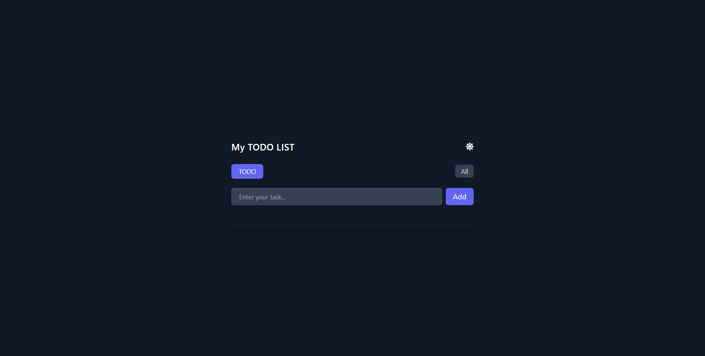

# ✅ React Todo List

A modern and responsive Todo List application built with **React.js** and **Vite**.  
The application allows users to efficiently manage daily tasks with add, edit, delete, and preview functionality.

It also includes **Dark Mode**, **LocalStorage persistence**, **Toast Notifications**, and smooth UI animations.

---

## 🌐 Live Demo

🔗 **[View Live Demo](https://react-todo-list-five-olive.vercel.app/)**

> Replace `YOUR_VERCEL_LINK` with your deployed Vercel URL.

---

## 📸 Preview



---

## ✨ Features

- ➕ Add new tasks
- ✏️ Edit existing tasks
- 🗑️ Delete tasks
- 👁️ View task details
- 🌙 Dark Mode
- 💾 Save tasks using LocalStorage
- 🔔 Toast notifications
- 🎬 Smooth animations with Framer Motion
- 📱 Responsive user interface
- ⚡ Fast development with Vite
- 🎨 Modern and clean UI

---

## 🛠️ Technologies Used

### Frontend

- **React.js**
- **JavaScript (ES6+)**
- **Tailwind CSS**
- **Framer Motion**

### Libraries

- **React Icons**
- **React Toastify**

### Browser Storage

- **LocalStorage**

### Development Tools

- **Vite**
- **Git**
- **GitHub**
- **VS Code**

---

## 📂 Project Structure

```text
react-todo-list/
│
├── public/
│
├── src/
│   ├── assets/
│   │
│   ├── App.jsx
│   ├── App.css
│   ├── index.css
│   └── main.jsx
│
├── .gitignore
├── eslint.config.js
├── index.html
├── package.json
├── package-lock.json
├── vite.config.js
└── README.md
